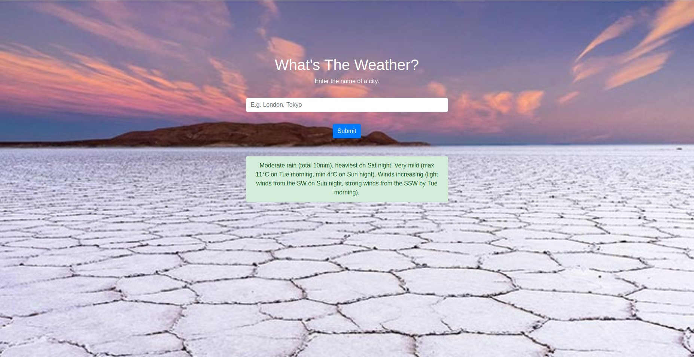

# Weather Scraper

## Prerequisites

* Install PHP CLI

## Usage

Go to the project folder

```sh
cd weather-scraper
```

Run the server

```sh
php -S localhost:8000
```

Then use your web browser and go to localhost:8000 and you should see the app running!


